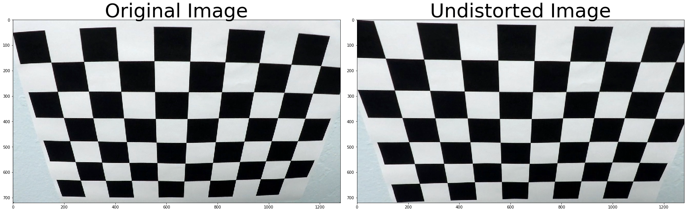
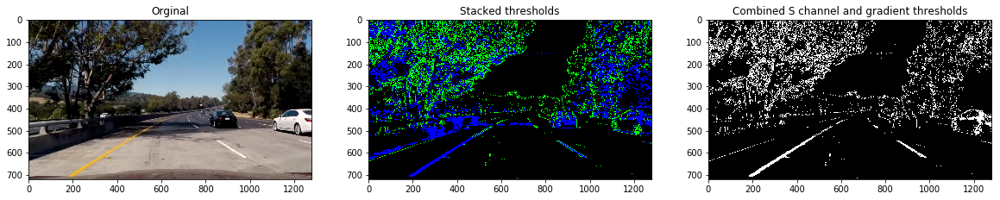
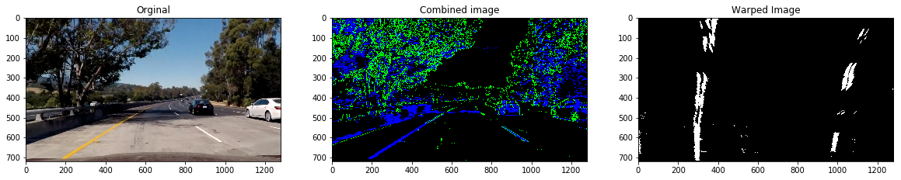
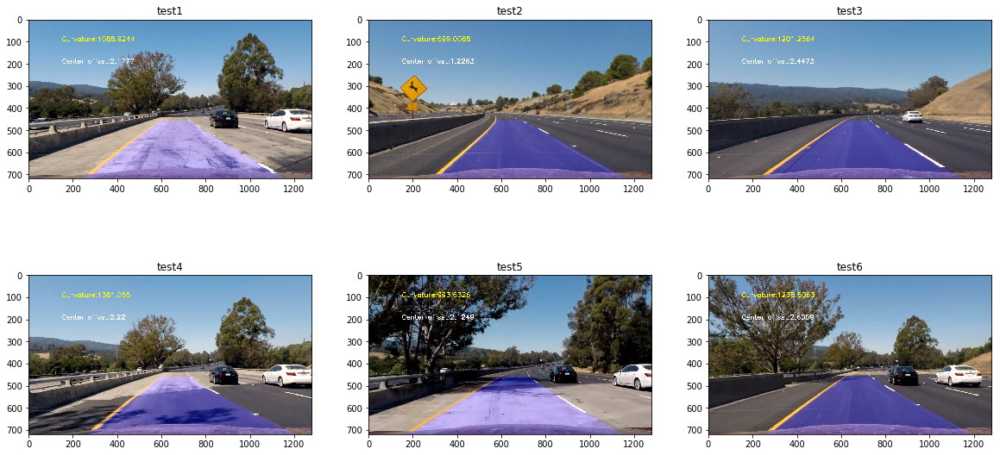

# Advance Lane Finding Project
Marking the lane boundaries and area in front

Started the project by calibrating camera with the sample images provided. 

Second step was to generate a binary image where lanes alone are visible. This seemed easy but soon found out to be very challenging when we consider images with shadows and extreme day light. It took lot of iterations and utlimatley found a way to integrate 'l' from hls space to get an image that can marked lanes in images which has shadow.

Third step was to get the correct perspective. This again was not easy. I had to settle with manaul coded numbers and not so optimal output. I decided to move on after reading in forum most of us had the same issue.

Fourth step was to find the polynomial. Going for 11 frames and polyfit method did a good job in defining the curve the lanes are taking. Used the best fit polynomial numbers obtained to calculate curvature and center calculation. For curvature I happen to take average of left and right lane and for Center.

Challenges faced:
1. Lot of iterations to find the correct image
2. Curvature and Center not sure what should be the range.

Suggestions:
1. To help us find lanes: I would rather take the define the search boundary to be the 'center of camera mount + 1/2 of car length  + some extra pixels/meter . If no lane can be found using filters we should fall back on prior known ones or keep increasing the extra pixels/meter until a straight line can be identified.
2. I would recommend that we have more explanation and organization around perspective, curvature finding

Improve on:
1. Identifying lanes during extreme day light or snow on the sides of road or road full of shadow or during merge
2. Work on challange videos
Further Read :
1. Curvature & Center calcuations
2. Convolution Method
Video
https://youtu.be/RoctF9_wb5c
